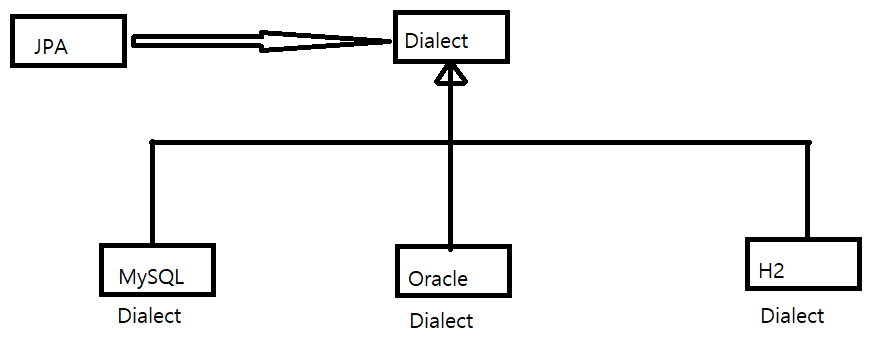
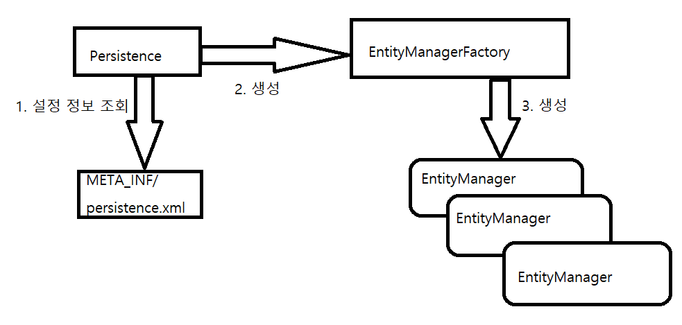
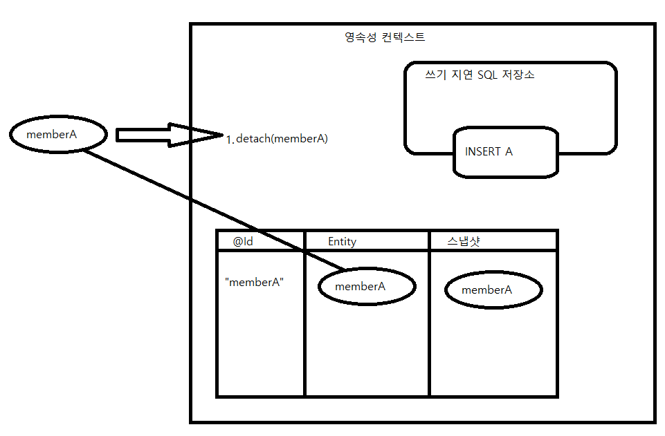
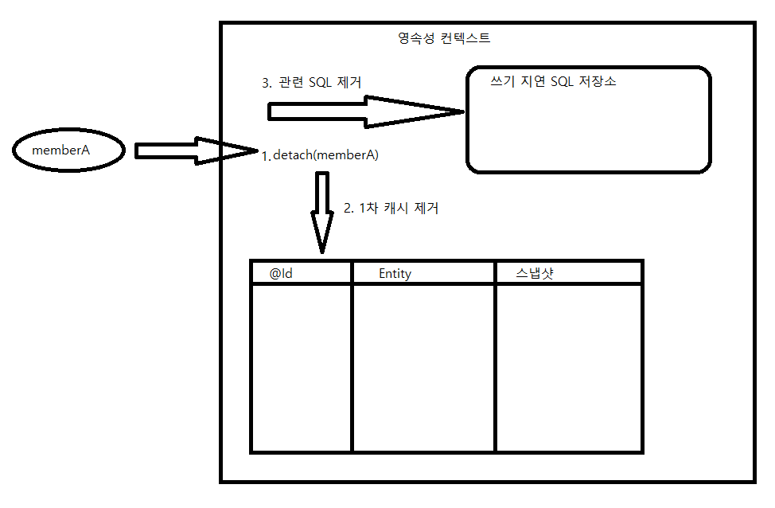

- @Entity
- 해당 어노테이션이 붙은 클래스를 테이블과 매핑한다고 JPA에게 알린다. 엔티티 클래스라고 부른다.

- @Table
- 엔티티 클래스에 매핑할 테이블 정보를 알려준다.
- @Table(name = "MEMBERS") name 속성을 사용해 엔티티를 MEMBER 테이블에 매핑한다.
- 만약 name 속성을 생략하면 단순히 클래스 이름을(더 정확히는 엔티티 이름) 테이블 이름으로 사용한다.

- @Id
- 엔티티 클래스의 필드를 테이블의 기본 키(Primary Key)에 매핑하며 식별자 필드라 한다.

- @Column
- 필드를 컬럼에 매핑한다.

- 매핑 정보가 없는 필드
- 매핑 어노테이션을 생략하면 필드 이름을 사용해 컬럼과 매핑을 한다.
- 만약 DB가 대소문자를 구분한다면 @Column(name="AGE")와 같이 명시적으로 매핑해야 한다.

- 매핑작업을 통해 JPA는 어떤 엔티티를 어떤 테이블에 저장해야 하는지 알 수 있게 되었다.

### JPA 기본 설정 파일 Persistence.xml

- JPA는 persistence.xml을 사용해 필요한 설정 정보를 관리한다.
- 설정 파일이 META-INF/persistence.xml 클래스 패스 경로에 있으면 별도의 설정 없이 JPA가 인식한다.

```xml
<?xml version="1.0" encoding="UTF-8"?>
<!-- xml 네임스페이스와 사용할 버전을 지정 -->
<persistence xmlns="http://xmlns.jcp.org/xml/ns/persistence" version="2.1">
    <!-- 영속성 유닛에 고유한 이름을 부여 -->
    <persistence-unit name="jpabook">

        <properties>

            <!-- 필수 속성 -->
            <property name="javax.persistence.jdbc.driver" value="org.h2.Driver"/>
            <property name="javax.persistence.jdbc.user" value="sa"/>
            <property name="javax.persistence.jdbc.password" value=""/>
            <property name="javax.persistence.jdbc.url" value="jdbc:h2:tcp://localhost/~/test"/>
            <property name="hibernate.dialect" value="org.hibernate.dialect.H2Dialect"/>

            <!-- 옵션 -->
            <property name="hibernate.show_sql" value="true"/>
            <property name="hibernate.format_sql" value="true"/>
            <property name="hibernate.use_sql_comments" value="true"/>
            <property name="hibernate.id.new_generator_mappings" value="true"/>

            <!--<property name="hibernate.hbm2ddl.auto" value="create" />-->
        </properties>
    </persistence-unit>

</persistence>
```

- hibernate 속성
- hibernate.dialect: 데이터베이스 방언 설정

#### 데이터 베이스 방언

- JPA는 특정 데이터베이스에 종속적이지 않은 기술이기 때문에 프로젝트의 데이터베이스를 손쉽게 교체할 수 있다.
- 다만 데이터베이스마다 조금씩 SQL 문법이 다르다는 문제점이 발생한다.
- SQL 표준을 지키지 않거나 특정 데이터베이스만의 고유한 문법 혹은 기능을 방언(Dialect)이라 한다
  
- 개발자는 JPA 표준 문법에 맞춰 JPA를 사용해 개발을 하고 데이터베이스에 의존적인 SQL은 해당 DB의 Dialect가 처리해준다.



1. 설정 정보 조회
2. EntityManagerFactory 생성

- 우선 persistence.xml의 설정 정보를 사용해서 엔티티 매니저 팩토리를 생성해야 한다.

```java
//엔티티 매니저 팩토리 생성
//Persistence 클래스를 사용하여 엔티티 매니터 팩토리 생성
//아래의 코드는 META-INF/persistence.xml에서 이름이 "jpabook"인 영속성 유닛을 찾아 엔티티 메니저 팩토리를 생성한다.
EntityManagerFactory emf=Persistence.createEntityManagerFactory("jpabook");
```

- 엔티티 매니저 팩토리를 생성하는 비용은 굉장히 높기 때문에 애플리케이션 전체에서 한 번만 생성하고 공유해서 사용하는 것이 좋다.

3. 엔티티 매니저 생성

```java
EntityManager em=emf.createEntityManager(); //엔티티 매니저 생성
```

- JPA 의 기능 대부분은 엔티티 매니저가 제공한다. (데이터베이스 등록/수정/삭제/조회)
- 엔티티 매니저는 내부에 데이터 소스를 유지하면서 데이터베이스와 통신한다. -> 엔티티 매니저를 가상의 데이터베이스로 생각 할 수도 있다.
- **엔티티 매니저는 데이터베이스 커넥션과 밀접한 관계를 가지므로 스레드간에 공유하거나 재사용하면 위험하다.**

```java
em.close(); //엔티티 매니저 종료
        emf.close(); //엔티티 매니저 팩토리 종료
```

- 사용이 완료된 엔티티 매니저는 항상 종료를 해줘야 하며 애플리케이션이 종료될 때 엔티티 매니저 팩토리 역시 종료시켜야 한다.

#### 트랜잭션 관리

- JPA를 사용하면 항상 트랜잭션 안에서 데이터를 변경해야 한다.
- 트랜잭션 외부에서 데이터를 변경하면 예외가 발생한다


- 트랜잭션을 사용하기 위해 엔티티 매니저에서 트랜잭션 API를 받아와야 한다.
- 받아온 트랜잭션 기능을 사용해 비즈니스 로직이 정상 동작하면 트랜잭션을 커밋하고, 예외가 발생하면 롤백한다.

```java
        EntityTransaction tx=em.getTransaction(); //트랜잭션 기능 획득

        try{
        tx.begin(); //트랜잭션 시작
        logic(em);  //비즈니스 로직
        tx.commit();//트랜잭션 커밋

        }catch(Exception e){
        tx.rollback(); //트랜잭션 롤백
        }
```

#### 비즈니스 로직

```java
public static void logic(EntityManager em){

        String id="id1";
        Member member=new Member();
        member.setId(id);
        member.setUsername("지한");
        member.setAge(2);

        //등록
        em.persist(member);

        //수정
        member.setAge(20);

        //한 건 조회
        Member findMember=em.find(Member.class,id);
        System.out.println("findMember="+findMember.getUsername()+", age="+findMember.getAge());

        //목록 조회
        List<Member> members=em.createQuery("select m from Member m",Member.class).getResultList();
        System.out.println("members.size="+members.size());

        //삭제
        em.remove(member);

        }
```

- 등록, 수정, 삭제, 조회 작업이 엔티티 매니저를 통해 수행된다.

##### 등록

- 엔티티를 저장하기 위해서는 엔티티 매니저의 persist() 메소드에 저장할 엔티티를 넘겨주면 된다.
- JPA는 회원 엔티티의 매핑 정보를 분석해서 상황에 맞는 INSERT SQL을 만들어 데이터베이스에 전달한다.

##### 수정

- JPA는 어떤 엔티티가 변경 되었는지 추적하는 기능을 갖추고 있다.
- 엔티티의 값만 변경하면 상황에 맞는 UPDATE SQL을 생성해 데이터베이스에 전달한다.

##### 삭제

- 등록과 비슷하게 엔티티 매니저의 remove를 사용하여 삭제하려는 엔티티를 넘겨주면 상황에 맞는 DELETE SQL을 생성해 전달한다.

##### 한건 조회

- find() 메소드는 조회할 엔티티 타입과 @Id로 데이터베이스 테이블의 기본 키와 매핑한 식별자 값으로 엔티티 하나를 조회하는 가장 단순한 조회 메소드
- find()를 사용하면 상황에 맞는 SELECT SQL을 생성해 데이터베이스에 전달하고 결과를 조회해 결과 값으로 엔티티를 생성해 반환한다.

#### JPQL

```java
//목록 조회
TypedQuery<Member> query=em.createQuery("select m from Member m",Member.class);
        List<Member> resultList=query.getResultList();

//혹은 간단하게
        List<Member> members=em.createQuery("select m from Member m",Member.class).getResultList();
        System.out.println("members.size="+members.size());
```

- JPA를 사용한다는 것은 엔티티 객체를 중심으로 개발을 하고 나머지 DB에 대한 처리는 JPA에 맡기는 것이다.
- 검색쿼리를 만들게 된다면 테이블을 대상으로 검색을 하는것이 아니라 엔티티를 객체를 대상으로 검색해야 한다.
- 하지만 이를 위해서는 DB의 모든 데이터를 엔티티 객체로 불러온 다음에 검색을 해야하는데 사실상 불가능
- 이를 해결하기 위해 JPA는 JPQL(Java Persistence Query Language)이라는 쿼리 언어로 문제를 해결한다.


- JPQL은 SQL을 추상화한 객체지향 쿼리 언어.
- JPQL은 엔티티 객체를 대상으로 쿼리한다. 즉 클래스와 필드를 대상으로 쿼리한다.


- 위의 JPQL에서 "select m from Member m"에 나온 Member는 회원 엔티티 객체를 말하는 것이다. 절대로 MEMBER 테이블이 아니다.


##### 엔티티 삭제
- 엔티티를 삭제하기 위해서는 우선 대상 엔티티를 조회해야 한다.
```java
Member memberA = em.find(Member.class, "memberA");
em.remove(memberA);
```
- 삭제 역시 remove()를 호출하면 즉시 삭제되는 것이 아니라 엔티티 등록과 비슷하게 삭제 쿼리를 쓰기 지연 SQL 저장소에 등록한 후 트랜잭션을 커밋해서 플러시를 호출해 실제 데이터베이스에 쿼리를 전달한다.
- remove()를 호출하면 해당 엔티티는 영속성 컨텍스트에서 제거되기 때문에 이를 재사용하지 말고 가비지 컬렉션의 대상이 되도록 두는것이 좋다.


#### 플러시
- 영속성 컨텍스트의 변경 내용을 데이터베이스에 반영한다
1. 변경 감지가 동작해서 영속성 컨텍스트에 있는 모든 엔티티를 스냅샷과 비교, 수정된 엔티티를 찾는다.
  - 수정된 엔티티가 있는 경우엔 수정 쿼리를 만들어 쓰기 지연 SQL 저장소에 등록해둔다.
2. 쓰기 지연 SQL 저장소의 쿼리를 데이터베이스에 전송한다. (등록, 수정, 삭제쿼리)

- 영속성 컨텍스트를 플러시 하는 방법들
1. em.flush()를 직접 호출
2. 트랜잭션 커밋 시 플러시 자동 호출
3. JPQL 쿼리 실행 시 플러시 자동 호출

##### 트랜잭션 커밋 시 플러시 자동 호출
- 트랜잭션을 커밋하기 전에 반드시 플러시를 호출해서 영속성 컨텍스트의 변경 내용을 데이터베이스에 반영해야 한다.
- JPA는 이런 문제를 예방하기 위해 트랙잭션을 커밋할 때 플러시를 자동으로 호출한다.

##### JPQL 쿼리 실행 시 플러시 자동 호출
```java
em.persist(memberA);
em.persist(memberB);
em.persist(memberC);

query = em.createQuery("select m from Member m", Member.class);
List<Member> members = query.getResultList();
```

- 먼저 em.persist()를 호출해서 엔티티들을 영속 상태로 만들었다. 이 엔티티들은 영속성 컨텍스트에만 있고 아직 데이터베이스에는 반영되지 않았다.
- **이때 JPQL을 실행하면 어떻게 될까?**
- JPQL은 SQL로 변환되어 데이터베이스에서 엔티티들을 조회하지만 엔티티들은 아직 데이터베이스에 없으므로 쿼리 결과로 조회되지 않는다.
- 이런 이슈때문에 쿼리를 실행하기 직전에 영속성 컨텍스트를 플러시해서 변경 내용을 데이터베이스에 반영해야 한다.
- 식별자 기준으로 조회하는 find() 메소드를 호출할 때는 플러시가 실행되지 않는다.

###### 플러시 모드 옵션
```java
em.setFlushMode(FlushModeType.COMMIT) //커밋할때만 플러시
em.setFlushMode(FlushModeType.AUTO) // 커밋 혹은 쿼리 실행시 플러시
```

###### **플러시는 영속성 컨텍스트에 보관된 엔티티를 지우는 것이 아닌 영속성 컨텍스트의 변경 내용을 데이터베이스에 동기화하는 것이다**

#### 준영속
- 영속성 컨텍스트가 관리하는 영속 상태의 엔티티가 영속성 컨텍스트에서 분리된 상태를 말한다.
- 준영송 상태로 만드는 3가지 방법
1. em.detach(entity) 특정 엔티티만 준영속 시킨다.
2. em.clear() 영속성 컨텍스트를 완전 초기화
3. em.close() 영속성 컨텍스트를 종료

```java
public void testDetached() {
    ...
    Member member = new Member();
    member.setId("memberA");
    member.setUsername("userA");
    
    em.persist(member);
    
    em.detach(member);
    
    transaction.commit();
        }
```

- 위의 예제에서는 먼저 회원 엔티티를 생성하고 영속화 한뒤 em.detach(member)를 호출했다. detach()를 호출하는 순간 1차 캐시부터 쓰기 지연 SQL 저장소까지 해당 엔티티를 관리하기 위한 모든 정보가 제거된다.



